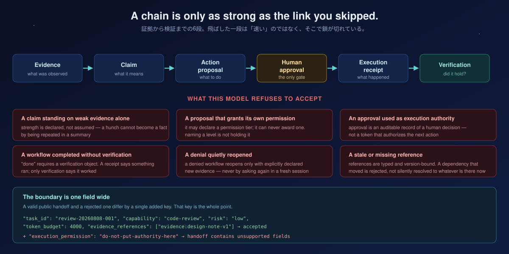

<h1 align="center">Workflow Governance Model</h1>

<p align="center">
  <b>A stale reference is rejected, not silently resolved.</b><br>
  <sub>証拠から検証までを型付きの鎖にする。飛ばした一段は「速い」のではなく、そこで鎖が切れている。</sub>
</p>

<p align="center">
  
  
  
  
  
</p>

<p align="center">
  <a href="https://github.com/UMEBOSHIISAN/mothership">Mothership</a> ·
  <a href="https://github.com/UMEBOSHIISAN/mothership-router">Mothership Router</a> ·
  <a href="docs/architecture.md">Architecture</a> ·
  <a href="docs/compatibility.md">Compatibility</a>
</p>

---

Workflow Governance Model (WGM) is a portable, fail-closed **data model** for the trail that should exist around AI-assisted work: what was observed, what was concluded, what was proposed, who approved it, what actually ran, and whether it held.

It is not an agent runner, execution router, scheduler, credential manager, or approval UI. It validates shapes and refuses bad ones.

---

## Why a data model and not a policy engine

Governance usually fails in a boring way. Nobody overrides a rule. Someone just writes `status: approved` a little earlier than they should have, and every system downstream believes it — because the label is the only thing anyone checks.

**A label is not evidence.** WGM exists so approval, evidence, and verification are objects with identities and versions rather than adjectives in a summary. Once they are objects, a stale one can be *detected* instead of trusted.

> 統治は「誰かがルールを破る」ことでは壊れない。誰かが少し早く `approved` と書き、下流の全員がそのラベルを信じることで壊れる。**ラベルは証拠ではない。** ここでは承認も証拠も検証も、識別子とバージョンを持つオブジェクトになる。オブジェクトになって初めて、古くなったものを**検出できる**。

---

## The chain, and what breaks it

<p align="center">
  
</p>

```text
Evidence -> Claim -> Action proposal -> Human approval -> Execution receipt -> Verification
```

Each object has an immutable identifier and version. References are typed and version-bound, so a dependency that moved is rejected rather than quietly resolving to whatever occupies that name today.

### Safety properties

- A claim cannot be supported by weak evidence alone.
- An action proposal declares a permission tier but cannot grant one.
- Approval is an auditable record, not execution authority.
- A completed workflow requires a verification object.
- A denied workflow reopens only with explicitly declared new evidence.
- Validation has no network, filesystem mutation, process, or model side effect.

That fifth one is worth dwelling on. Re-asking in a fresh session is the most natural way in the world to route around a "no" — the context is gone, the denial is gone, and the second answer looks like a first answer. Requiring **declared new evidence** to reopen is what makes a denial survive its own conversation.

---

## The boundary is one field wide

The public handoff object is deliberately small. Here is a valid one:

```json
{
  "schema_version": "1.0",
  "task_id": "review-20260808-001",
  "capability": "code-review",
  "risk": "low",
  "token_budget": 4000,
  "evidence_references": ["evidence:design-note-v1"]
}
```

Now add a single key that claims authority:

```diff
+ "execution_permission": "do-not-put-authority-here"
```

```text
validate_handoff(valid)    -> []
validate_handoff(invalid)  -> [HandoffError(path='$', message='handoff contains unsupported fields')]
```

The contract is **closed**: unknown fields are rejected rather than ignored. An ignored field is a field that can carry credentials, prompts, local paths, or a claim of execution permission across a boundary that was supposed to stop them. This object never includes any of those — not because it strips them, but because a document containing them is not a valid document.

> 未知のフィールドを「無視する」設計は、そのフィールドに何でも積めるということ。閉じた契約では、権限を名乗るキーが1つ増えただけで文書全体が不正になる。

---

## Quick start

Python **3.12+**, standard library only.

```sh
git clone https://github.com/UMEBOSHIISAN/workflow-governance-model.git
cd workflow-governance-model
PYTHONPATH=src python3 -m unittest discover -s tests -v      # 11 tests
```

> **`PYTHONPATH=src` is required** unless you install the package first. Without it the suite fails with `ModuleNotFoundError: No module named 'wgm'` and reports a single error — a path problem, not a broken checkout. To drop the prefix, run `python3 -m pip install -e .` once.
>
> `PYTHONPATH=src` を付けないと `ModuleNotFoundError` で1件エラーになる。チェックアウトが壊れているのではなくパスの問題。

```python
from wgm import validate_document

result = validate_document(document)
if not result.valid:
    for error in result.errors:
        print(error.code, error.path, error.message)
```

Two entry points, two shapes — check which one you want:

| Function | Returns | Use for |
| --- | --- | --- |
| `validate_document(document)` | `ValidationResult` with `.valid` and `.errors` | Full workflow documents |
| `validate_handoff(handoff)` | `list[HandoffError]` — empty means valid | The small public handoff object |

---

## Safe candidate ranking

WGM can rank locally declared candidates with `recommend_route(task, registry)`. It weighs a capability label, risk level, token budget, candidate capacity, and a transparent `cost_rank`, then returns one recommendation and its reasons.

```sh
PYTHONPATH=src python3 -m wgm examples/task.json examples/registry.json
```

```json
{
  "status": "recommended",
  "recommended_alias": "local-analysis",
  "reasons": ["eligible_candidate_with_lowest_cost_rank"],
  "authority_effect": false,
  "execution_effect": false
}
```

It reads two JSON files and prints a recommendation. It never starts a process, uses credentials, retries, falls back, inspects your machine, or changes an approval state. **High-risk work always returns `human_review_required`.**

A recommendation is an opinion with its reasoning attached. Connecting it to a real execution system is a separate human act, performed after reviewing the candidate, the credentials, the egress, and the exact command in that system.

---

## Composing the public ecosystem

```text
evidence + task
    |
    v
Workflow Governance Model   ── validates the authority trail
    |  (reviewed request, credential-free)
    v
Mothership Router           ── human-gated, digest-bound dry run
    |
    v
Mothership                  ── portable contracts, diagnostics, boundaries
```

| Project | Role |
| --- | --- |
| **Workflow Governance Model** | Validates evidence, claim strength, approval, receipt, and verification |
| [Mothership Router](https://github.com/UMEBOSHIISAN/mothership-router) | Turns a reviewed request into a human-gated dry-run manifest bound to a registry digest |
| [Mothership](https://github.com/UMEBOSHIISAN/mothership) | Supplies the portable environment contracts and diagnostics around both |

Neither package installs, configures, or invokes the other. Each is independently adoptable. See the [public handoff schema](schemas/workflow-handoff.schema.json), the [valid example](examples/handoff.valid.json), and the [compatibility guide](docs/compatibility.md).

---

## Non-goals

- Automatic model selection, retry, fallback, or execution.
- Credentials, endpoints, machine paths, host topology, or business policy.
- Replacing human approval with a model decision.

---

## Project docs

- [Architecture](docs/architecture.md)
- [Composition and compatibility](docs/compatibility.md)
- [Integration gates and roadmap](NEXT.md)
- [Contributing](CONTRIBUTING.md)
- [Security policy](SECURITY.md)

---

## License

MIT. See [LICENSE](LICENSE).

<p align="center">
  <sub><b>authority_effect: false · execution_effect: false</b><br>validation has no side effects, by construction</sub>
</p>
