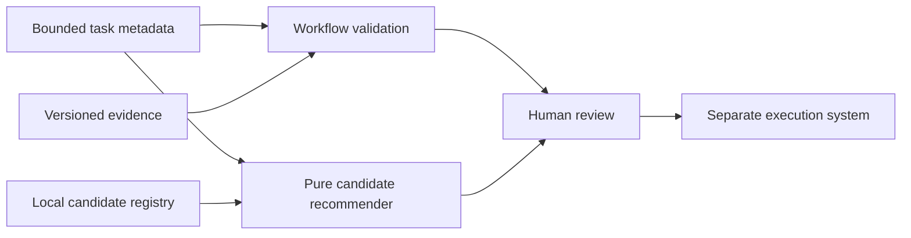

# Architecture

WGM has two deliberately separate functions:

1. `validate_document` checks a workflow's evidence and authority trail.
2. `recommend_route` ranks locally declared candidates without selecting an
   executor or performing any side effect.

The final arrow is outside WGM. The package neither implements nor authorizes
that external action.
